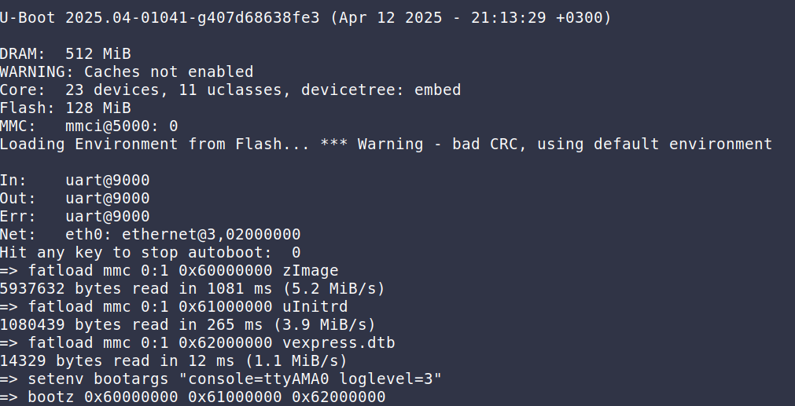
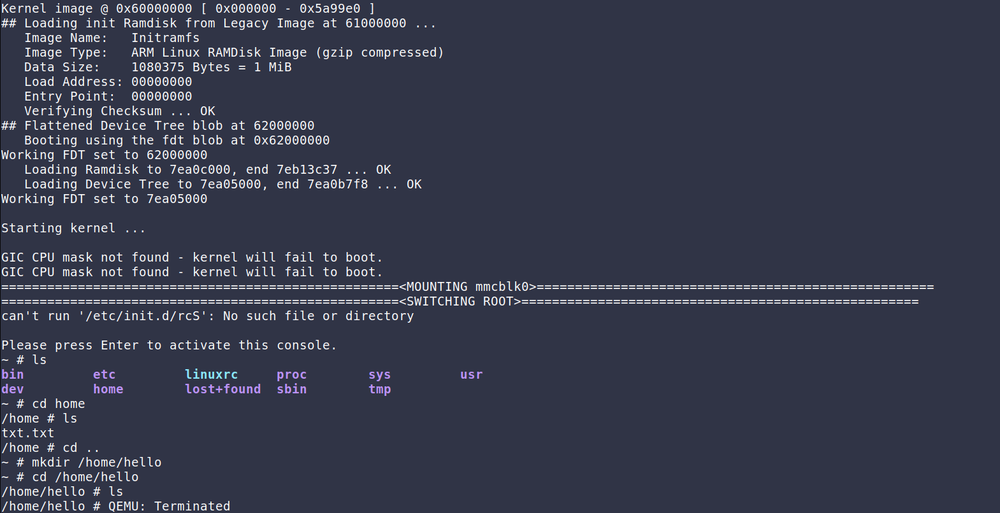
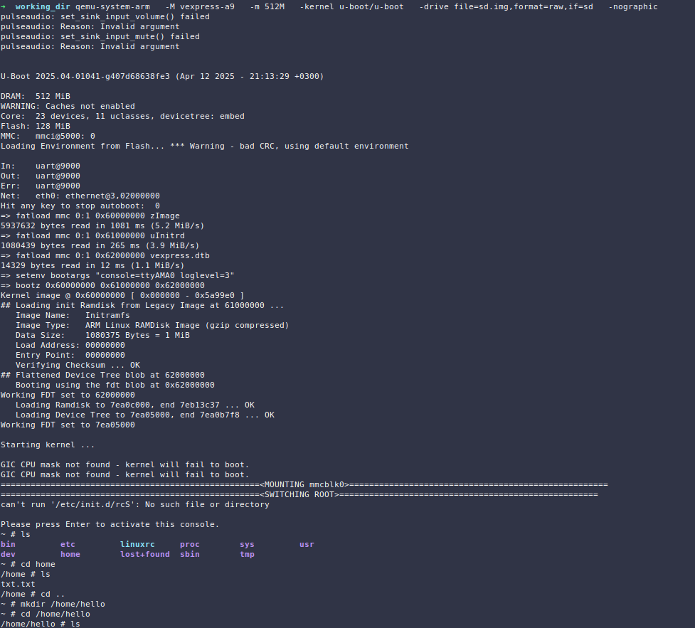

# Booting the Kernel

## Getting the Components Ready

First we need to get our components ready, while keeping the booting flow in mind:

*bootloader -> initramfs -> rootfs*

- First we will need to compile a bootloader (u-boot), this will help load the kernel and the initramfs into memory.

- Then we will need to compile the kernel.

- After that we have to create the initramfs, which has a simple init process that will be the first to run in memory and help us mount the root directory into our system.

- We also have to create the rootfs for initramfs to work with.

- Finally, we have to put everything together.

### Creating `initramfs`:

Generating the busybox binaries and links:
```bash
$ cd busybox-1_36_1/
$ make defconfig
# For this step we have to make sure to include:
# Settings ---> [*]Build static binary (no shared libs)
$ make menuconfig
$ make -j 8
# The files will be installed in busybox-1_36_1/_install
$ make install
```

Creating the structure of the initramfs:
```bash
$ mkdir -p initramfs/{bin,sbin,etc,proc,sys,usr/{bin,sbin},dev,tmp,home}
$ cp -a busybox-1_36_1/_install/* initramfs/
$ cd initramfs
$ vim init
$ chmod +x init

# This will help us mount rootfs
$ sudo mknod -m 600 /dev/mmcblk0p2 b 179 2
$ find . -print0 | cpio --null -ov --format=newc | gzip -9 > ../initramfs.cpio.gz
```
- initramfs/init:

    ```bash
    #!/bin/sh
    mount -t proc none /proc
    mount -t sysfs none /sys

    echo "====================================================<MOUNTING mmcblk0>===================================================="
    mount -t ext4 /dev/mmcblk0p2 /mnt

    echo "====================================================<SWITCHING ROOT>===================================================="
    exec switch_root /mnt /sbin/init
    ```

### Creating `rootfs`:

Creating the structure of the rootfs:
```bash
$ mkdir -p rootfs/{bin,sbin,etc,proc,sys,usr/{bin,sbin},dev,tmp,home}
$ cp -a busybox-1_36_1/_install/* rootfs/
$ sudo mknod -m 666 rootfs/dev/console c 5 1
$ sudo mknod -m 666 rootfs/dev/null c 1 3

# These will help us get rid of a warning message that will pop up if these files are not included in root
$ sudo mknod dev/tty2 c 4 2
$ sudo mknod dev/tty3 c 4 3
$ sudo mknod dev/tty4 c 4 4
```

Packing rootfs into an `ext4` image:
```bash
$ dd if=/dev/zero of=rootfs.ext4 bs=1M count=32
$ mkfs.ext4 rootfs.ext4
```

### Creating a dual partition:

In order to be able to work with `u-boot` to make it load the kernel and initramfs, we have to bundle the files into partitions (boot and rootfs) and give it to u-boot.

Creating the image:
```bash
# Creating the image
$ dd if=/dev/zero of=sd.img bs=1M count=64

# Creating the partitions
# 2 partitions:
# - partition 1 (FAt32): has the boot files
# - partition 2 (ext4): has the root filesystem
$ fdisk sd.img
$ sudo losetup -f --show sd.img -P

# Formatting the partitions
$ sudo mkfs.vfat /dev/loop0p1
$ sudo mkfs.ext4 /dev/loop0p2
```

Adding boot files to our boot partition:
```bash
# Creating an image of the initramfs file that u-boot can work with
$ mkimage -A arm -T ramdisk -C gzip -n "Initramfs" -d initramfs.cpio.gz uInitrd

$ sudo mount /dev/loop0p1 mnt

# Copying the boot files into the partition
$ sudo cp linux-6.15-rc1/arch/arm/boot/zImage mnt/
$ sudo cp linux-6.15-rc1/arch/arm/boot/dts/arm/vexpress-v2p-ca9.dtb mnt/vexpress.dtb
$ sudo cp uInitrd mnt/

$ sudo umount mnt
```

Adding root files to the rootfs partition:
```bash
$ sudo mount /dev/loop0p2 mnt
$ sudo cp -a rootfs/* mnt/
$ sudo umount mnt
$ sudo losetup -d /dev/loop0
```

## Booting the system with qemu:

### Boot Flow:
We will be running u-boot in qemu, while providing the environment with a disk img that has partitions holding the boot files and the root filesystem.\
U-boot will first start, then we will have to load our boot files into memory through u-boot.\
After that we will tell u-boot to boot the system.
- First the kernel will call the initramfs and will start the init script it has.
- Then the init in initramfs will mount the root filesystem and switch to it, giving us access to our system.

```bash
qemu-system-arm -M vexpress-a9 -m 512M -kernel u-boot/u-boot -drive file=sd.img,format=raw,if=sd -nographic
```
We will have to load the boot files we have in our boot partition into memory using u-boot, then start the system:
```
fatload mmc 0:1 0x60000000 zImage
fatload mmc 0:1 0x61000000 uInitrd
fatload mmc 0:1 0x62000000 vexpress.dtb
setenv bootargs "console=ttyAMA0 loglevel=3"
bootz 0x60000000 0x61000000 0x62000000
```






In the image we can notice that a file `txt.txt` was already in the system, this file was created in a previous run, which shows that files are being stored in the system and we're not running the root in memory.

**The whole process:**

___

List of references:
- [Creating Initramfs](https://medium.com/@kiky.tokamuro/creating-initramfs-5cca9b524b5a)
- [Build a kernel, initramfs and Busybox to create your own micro-Linux](https://cylab.be/blog/320/build-a-kernel-initramfs-and-busybox-to-create-your-own-micro-linux#prerequisites)
- [Booting Linux with U-Boot on QEMU ARM](https://balau82.wordpress.com/2010/04/12/booting-linux-with-u-boot-on-qemu-arm/)
- [/dev/tty: No such file or directory](https://www.linuxquestions.org/questions/linux-software-2/dev-tty-no-such-file-or-directory-889996/)
