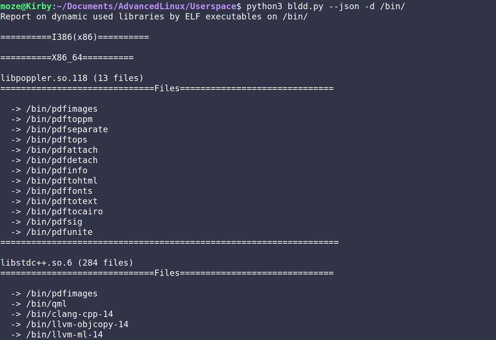
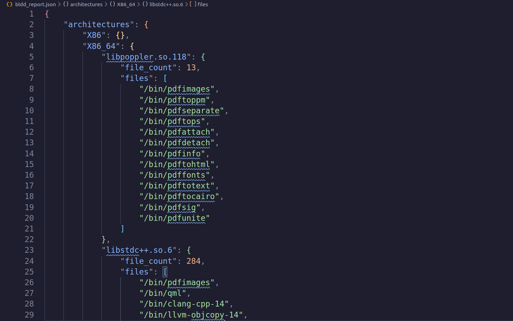

# Backward List Dynamic Dependencies Script

## Tools Used
- python3
- [LIEF : Library to Instrument Executable Formats](https://lief.re/)

## Usage

```bash
$ python3 bldd.py -h
usage: bldd.py [-h] -d D [--json]

This script will traverse through all the files in the specified directory and print the dynamic libraries used by ELF executables

options:
  -h, --help  show this help message and exit
  -d D        Directory to traverse through
  --json      Output the report in JSON format
```

## Script Output
The scripts output the findings in the command line, while also giving the option generating a json file with the findings.

- Script output:


- Json findings:
